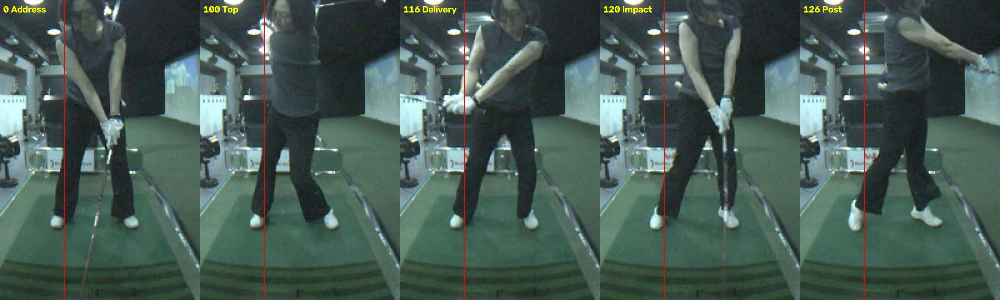

# 드라이버 스윙 분석 (2026-09-11)

- 촬영: 스크린골프, 정면(face-on), 드라이버 풀스윙
- 영상: 60fps, 240프레임(약 4초), 720x540
- 분석 방법: 전체 프레임 추출 후 톱 → 딜리버리 → 임팩트 → 임팩트 직후 구간을 프레임 단위로 비교

빨간 세로선은 어드레스 때 머리 위치. 왼쪽부터 어드레스(0) → 톱(100) → 딜리버리(116) → 임팩트(120) → 임팩트 직후(126).

## 한 줄 결론

채를 던지는 **타이밍 자체는 좋다.** 문제는 던지는 주체가 몸이 아니라 **팔과 상체**라서 스피드가 덜 나오고 임팩트가 불안정해지는 구조다.

## 잘 되고 있는 부분

- 톱에서 어깨 회전이 충분하고 왼팔이 곧게 유지된다.
- 백스윙 중 머리가 어드레스 위치(빨간선)에 그대로 있다. 스웨이 없음.
- 딜리버리(손이 골반 높이)까지 손목 각(래그)이 거의 90도로 살아 있다. 캐스팅 없음.
- 임팩트 직후 양팔이 쭉 뻗어 나가고, 피니시가 왼발 위에서 균형 잡힌다.

## 문제가 되는 부분 (채를 던지는 구간)

### 1. 상체가 타겟 쪽으로 밀려 나간다
톱에서는 빨간선 위에 있던 머리가 딜리버리와 임팩트에서 선보다 타겟 쪽으로 이동해 있다.
드라이버는 임팩트 때 머리가 어드레스보다 오히려 뒤에 있어야 하는데 반대로 앞에 있다.
던질 공간이 없어져서 팔이 급하게 펴지고, 헤드가 공을 위에서 내려찍는 형태가 된다.

### 2. 임팩트에서 골반과 어깨가 모두 정면(카메라)을 본다
왼무릎은 아직 굽어 있고 오른발은 완전히 붙어 있다.
하체가 멈춘 상태에서 팔로 채를 던지고, 골반은 공을 치고 난 뒤(126프레임)에야 열린다. 순서가 거꾸로다.

### 3. 오른팔이 임팩트 직전에 한꺼번에 펴진다
임팩트 직전 3프레임(약 0.05초) 안에 오른팔이 다 펴진다.
몸이 멈춘 것을 팔 힘으로 메우는 전형적인 "팔로 때리는" 릴리스.

### 4. 템포

| 구간 | 시간 |
|---|---|
| 백스윙 | 약 1.6초 |
| 다운스윙 | 약 0.37초 |
| 비율 | 약 4.4 : 1 (투어 기준 3 : 1) |

백스윙이 많이 느려서 전환에 흐름이 없고, 톱에서 상체로 "확" 시작하게 된다.

## 고치는 방향

핵심: "채를 던진다" = 손으로 던지는 것이 아니라, **몸이 왼쪽에서 버티며 멈춰 주면 채가 저절로 튕겨 나가는 것.**

순서: 왼발 밟기 → 골반 열림 → 머리는 뒤에 남기 → 팔과 채가 마지막에 풀림

### 드릴

1. **오른손 언더핸드 던지기** (우선순위 1)
   채 없이 오른손에 공을 쥐고, 백스윙 자세에서 타겟 쪽으로 낮게 던진다.
   머리는 뒤에 두고 왼발에 체중이 먼저 실려야 공이 멀리 간다. 이 감각이 현재 스윙에 없는 감각.

2. **스텝 드릴**
   발을 모으고 백스윙한 뒤, 다운스윙 시작과 동시에 왼발을 타겟 쪽으로 내딛으며 친다.
   하체 → 상체 순서를 강제로 만든다.

3. **머리 뒤에 남기기**
   다운스윙에서 머리를 타겟 반대쪽으로 살짝 밀어 두는 느낌. 실제로는 제자리에 머무는 정도가 된다.
   공 뒤쪽에 얼라인먼트 스틱을 꽂고 그것을 본다는 느낌이 도움이 된다.

4. **왼발 포스팅** (우선순위 2)
   딜리버리(손이 골반 높이)에 도달할 때 이미 왼무릎이 펴지기 시작해야 한다.
   왼쪽 골반을 뒤로 빼면서 왼다리로 땅을 밀어 올리는 느낌. 이 동작이 채를 던지는 스위치.

5. **하프스윙(L to L) 릴리스 연습**
   3시 → 9시 스윙에서 가슴이 임팩트 때 이미 타겟 쪽으로 살짝 돌아가 있는지 확인.
   팔로 던지는 습관은 작은 스윙에서 훨씬 빨리 고쳐진다.

6. **백스윙을 조금 빠르게**
   "하나, 둘, 셋"에 톱, "하나"에 임팩트. 3:1에 가까워지면 전환에서 상체가 덤비는 것이 줄어든다.

## 다음 촬영 때

- 측면(다운더라인) 영상도 같이 촬영하면 스윙 궤도와 상체 밀림을 더 정확히 볼 수 있다.
- 현재 카메라는 약간 광각이고 해상도가 낮아 골반 열림 각도 등 수치는 정확히 잴 수 없었다.
